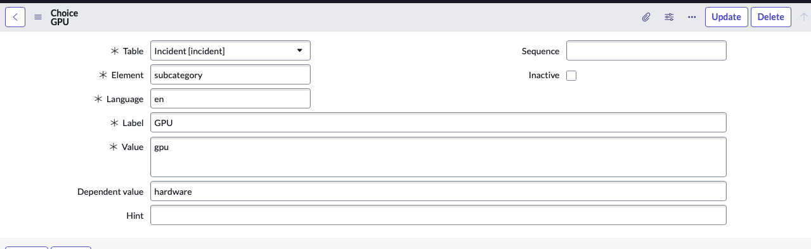

# Service Now Fundementals Course

### Configuration and Customization
- A baseline implementation is a set of installed application on an instance before any customization or configuration is made.
- To active applications and application features:
    - Access the Plugins module, Servicenow Store, or make a request from Servicenow.
- Dot-Waking gathers information from a series of tables through reference fields.

#### Catagories
- To create a subcategory navigate to *sys_choice.list* and hit 'New' to create a new record.  
  - Fill in the element as 'subcategory' and add a dependent value such as 'hardware'.

- Identify a Choice field using a dropdown arrow. 
- Three components of a filter condition are *field*, *operator* and *value*.
- Dependent fields such as a choiceless or reference field will limit a field's values.
- A reference field will typically have a magnfying glass next to it.

#### Applications/ Access Control
- Access control rules restrict service now specific CRUD operations (Create, Read, Update, Delete).
- ACL's (Access Control Lists) contains an instance's access control rules. 
- If permissions are created using Roles and Conditional Expressions, the logic between both is AND.
##### Access Control Rules Types
- Good way to visualize ACL's is a House is a table, a room is a field and a key is an ACL.
- *Table.--none--*: No field is selected applies to the whole table.
- *Table.field*: Rule applies to one field on a record and it's case. (Specific Field ACL has highest priority rule.)
- *Table.* *: Wildcard rule applies to every field on a record without a *table.field* rule. Inverts the logic (Applying *Table.* * will 'lock' all the rooms in the house.)
#### Data Management
- *Configuration Managment Database*: Is a series of tables and fields that contain all the configuration item's (CI's) controlled by your company as well as their attributes and relationships.
- *Configuration Items*: Can be tangible or intangible devices or applications in the CMDB such as firewalls, computers, email services and services.
- Transform Maps are used to clean up, massage and valid the data before it gets imported into a Servicenow table.
- *Discovery* Scans the network to inventory devices and applications and updates the CMDB with the results for each unique datatype of hardware and software.
- *Service Mapping* (Top Down Discovery) augments CMDB with IT relationships and dependencies between CI's to model the IT components that comprise a Service.
- Three Tables of the CMDB: cmdb, cmdb_ci, cmdb_rel_ci.

#### Knowledge Management 
- Knowledge admins (knowledge_admins) roles can manage multiple knowledge bases.

## Flash Cards
A collection of Flashcards from [JonathanHullah](https://www.servicenow.com/community/training-and-certifications/just-passed-my-csa-certification-exam-sharing-my-own-study/m-p/2824487)
### Platform Overview And Navigation
| Question| Answer |
| --------------------------------------------------------------------------------- | ------- |
| ServiceNow Platform is in aPaaS. What does this stand for and what does it mean?  | Application Platform–as–a–Service. Means that the application is hosted in the Cloud and companies don’t need to manage equipment necessary to host these applications.|
| What are the 4 base workflows available within the ServiceNow platform to choose from? | IT Workflows, Employee Workflows, Customer Workflows, Creator Workflows |
