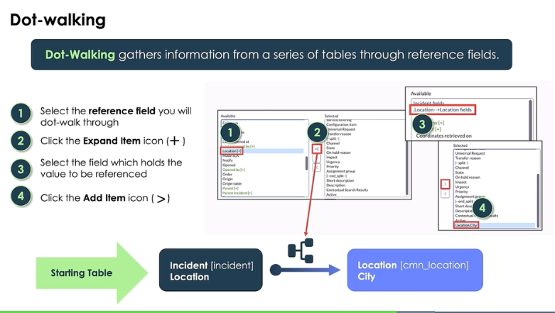

# Service Now Fundementals Course

### Configuration and Customization
- A baseline implementation is a set of installed application on an instance before any customization or configuration is made.
- To active applications and application features
    - Plugins module, Servicenow Store, Request from Servicenow
- Dot-Waking gathers information from a series of tables through reference fields.
